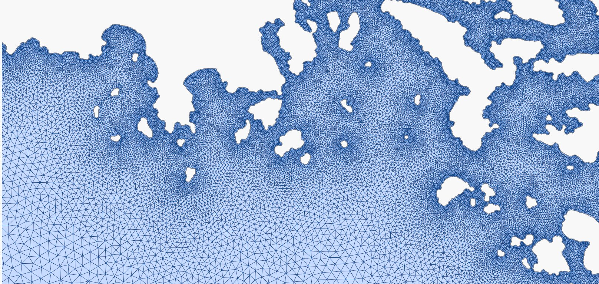

class: gray-background

# Research software engineering (RSE) in 10-15 minutes

.left-column50[
.fat[1:] The RSE role

.fat[2:] Toolset

.fat[3:] Courses

.fat[4:] Use cases

.fat[5:] Vision
]

.right-column50[
## [research-software.uit.no](https://research-software.uit.no/)


]

---

# FAIR principles and software

Researchers need to navigate many tools and concepts.


.cite[(c) [Scriberia](http://www.scriberia.co.uk) for [The Turing Way](https://the-turing-way.netlify.com), CC-BY]

---


.cite[Heidi Seibold, CC-BY 4.0, https://twitter.com/HeidiBaya/status/1579385587865649153]

---

# Research software engineers

.. are people who combine .emph[professional software expertise] with an .emph[understanding of research] .cite[https://researchsoftware.org/]

- Often people **who grew up in research** and liked computing and programming

- ... or people **who come from software development** drawn towards meaningful and impactful work of academia


## Resources

- [Society of Research Software Engineering](https://society-rse.org/)
- Recent conference: [RSECon 2022](https://rsecon2022.society-rse.org/)
- https://nordic-rse.org/
- [Nordic-RSE unconference 2022](https://nordic-rse.org/events/2022-online-unconference/)

---

# Our [team](https://research-software.uit.no/about/)

- We grew up in research (chemistry and biology)

- Interested in software development and computing

- Employed by IT department

- We are part of [Norwegian Research Infrastructure Services](https://documentation.sigma2.no/)

---

class: center, middle, inverse

# What we offer

---

# Help with improving your scripts/code

- .emph[Code review](we discuss code in a constructive way)
- Making code .emph[more reusable]
- Good practices for documentation


---

# Help with organising your code

- Git, GitHub, and GitLab
- Moving your work/project/code/data to Git
- Modularizing your code
- Organization of reusable Python/R notebooks

---

# Help with sharing your code

- Help with software licenses and open sourcing
- Publishing code
- Packaging and sharing software
- Containerization (Singularity, Docker)
- Help with pip, PyPI, and Conda

---

# Getting results sooner

- Improving scaling, CPU, and memory optimization
- Porting to GPU
- Moving from local computer to cloud or HPC
- Helping with running independent steps in parallel

---

# Our course portfolio via [coderefinery.org](https://coderefinery.org)

.left-column50[
- Version control
- Collaboration using Git
- Testing
- Documentation
- Notebooks
- Modular code development
- Reproducible research
- Software licensing
- How to share and publish code
- **...**

Lessons and recordings: https://coderefinery.or/lessons/
]

.right-column50[

]

---

# Use case 1: optimization

Oceanography: speed-up of grid mesh generation from days to seconds by a code
rewrite from Matlab to Python+Rust using a more optimal algorithm



---

# Use case 2: web development

- [SMARTool: The Strategic Mastery of Russian Tool](https://smartool.github.io/smartool-rus-eng/),
  Using GitHub Pages, JavaScript, and a CSV-based lightweight
  "database" to simplify maintenance, reuse, and contributions.

- [Constructicon: Searchable database of multiword grammatical constructions of Russian](https://constructicon.github.io/russian/).
  Moved a project from a dedicated web server and custom database to GitHub Pages, JavaScript, and a YAML-based lightweight
  "database" to simplify maintenance, reuse, and contributions.

---

# Use case 3: rewrite instead of buying a 30 GB hard disk

### Problematic if data is 30 GB big

```python
result = 0.0
with open("data.txt", "r") as f:
    lines = f.readlines()
    for line in lines:
        result += analyze(line)
```


### Better

```python
result = 0.0
with open("data.txt", "r") as f:
    for line in f:
        result += analyze(line)
```

---

class: center, middle, inverse

# Our vision

---

# Our vision

## Short term

- Provide consulting: good advice is **not** expensive
- .emph[Code review] sessions
- Work on "smaller" projects and .emph[document use cases]
- Focus on UiT
- Attract more projects


## Longer term

- Be part of funding applications
- Research groups have access to best in class RSE services
- Hire more staff who collaborate on projects
- "Proper" application procedure
- Going beyond UiT
- .emph[Career path opportunities]

---

# How everything nicely ties together

## Training, RSE-work, High-performance computing

- .emph[Staying current]: If we want to teach programming tools, we also have to write code

- .emph[Complementary skills]: We can solve problems with hardware or with software

- .emph[Progression]: Training events are a great place to advertize services


## Contact: https://research-software.uit.no/contact/
