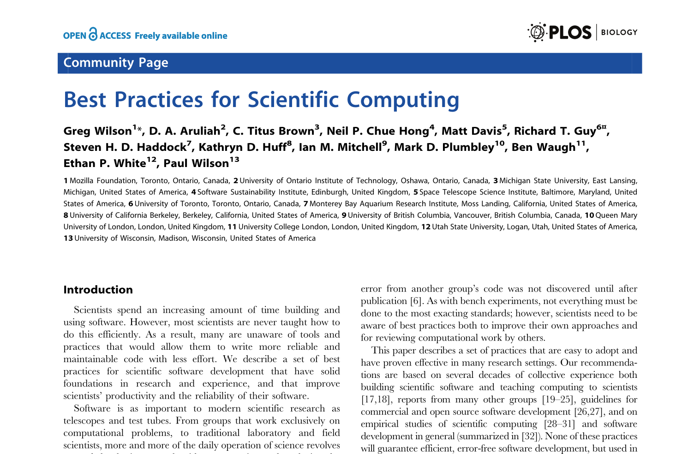
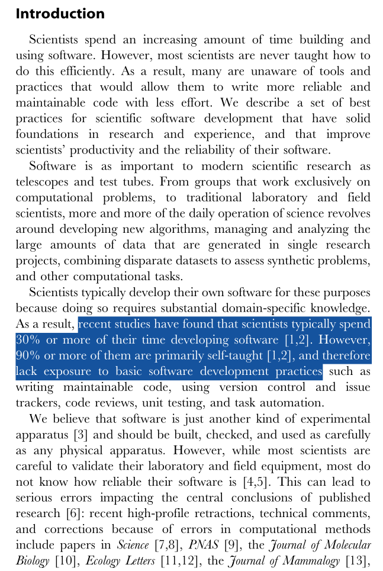
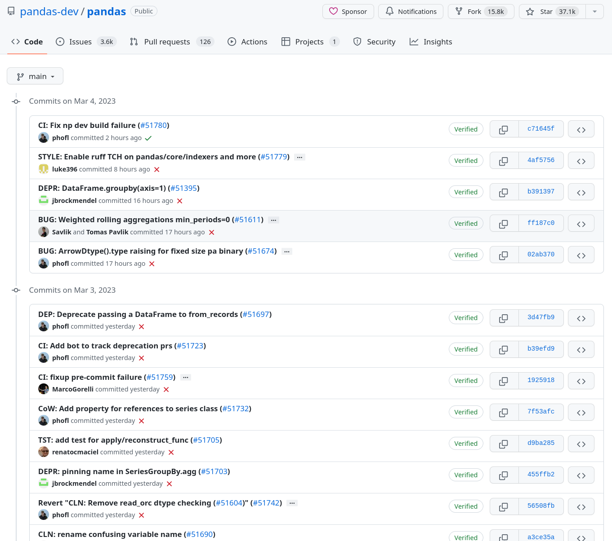
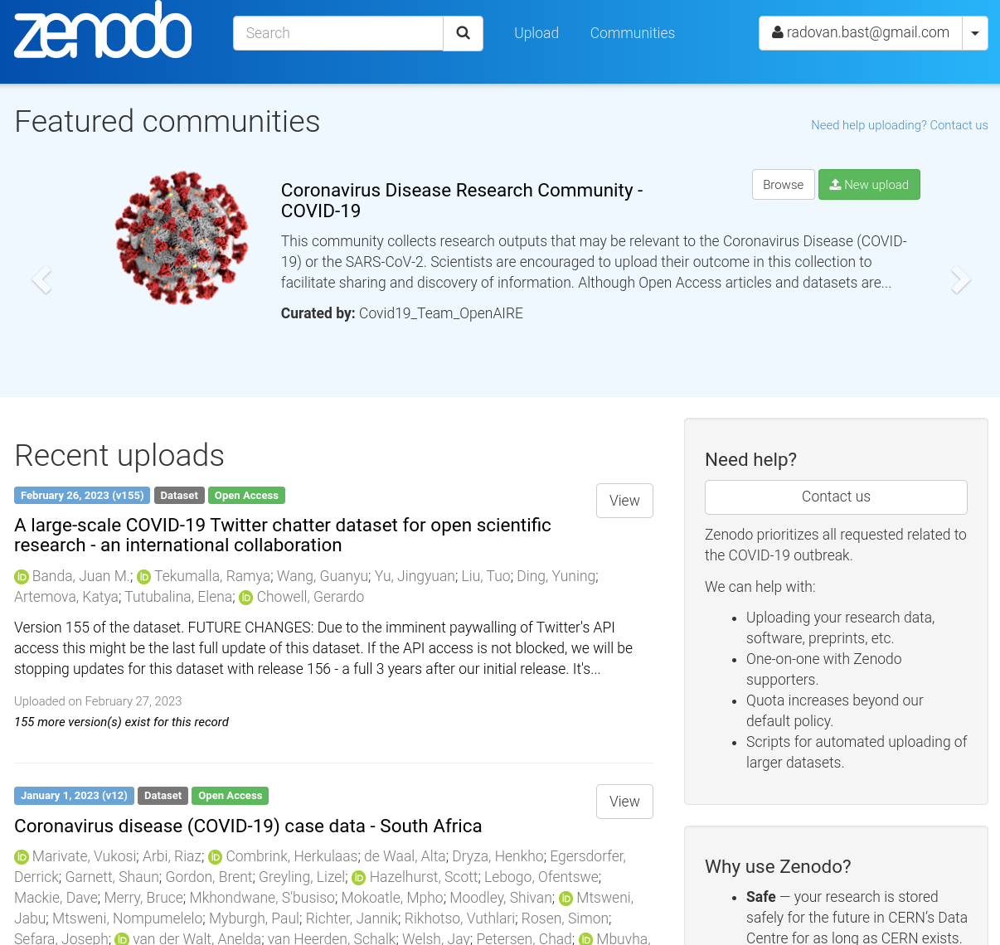
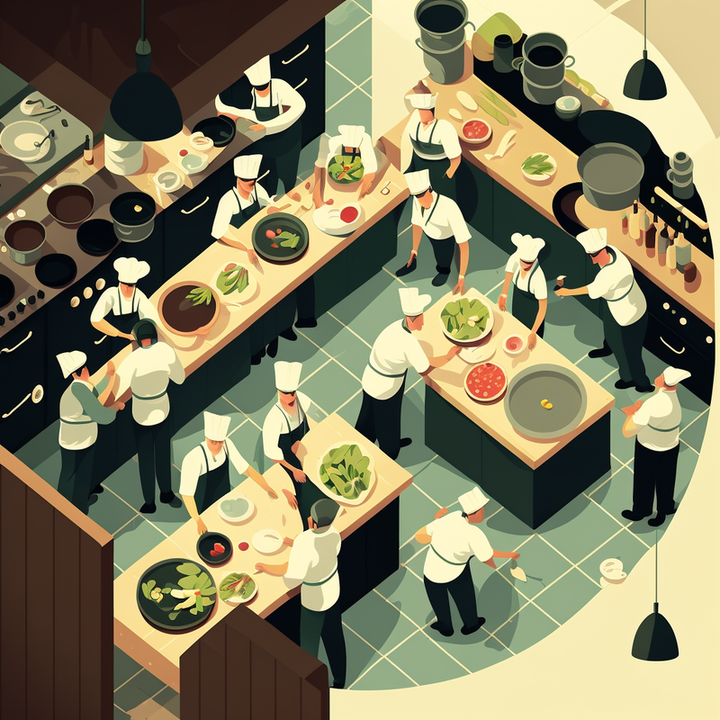
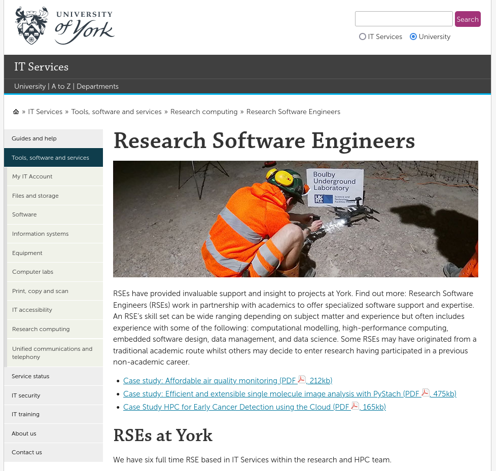
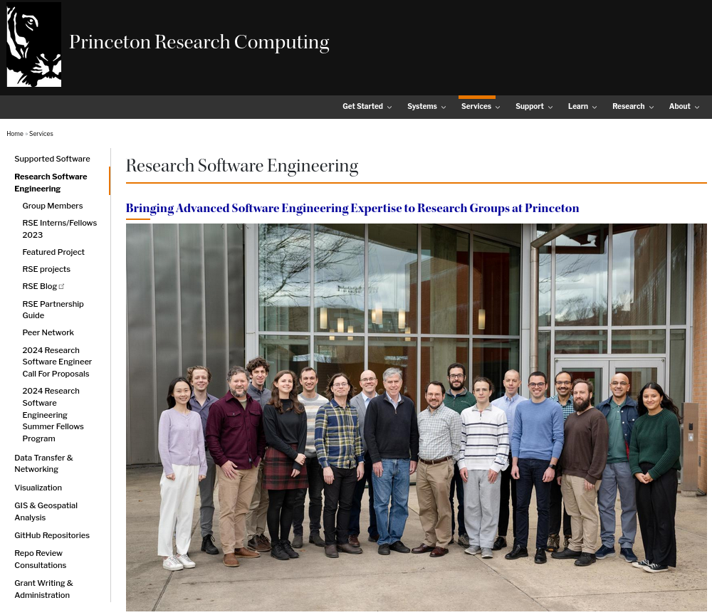
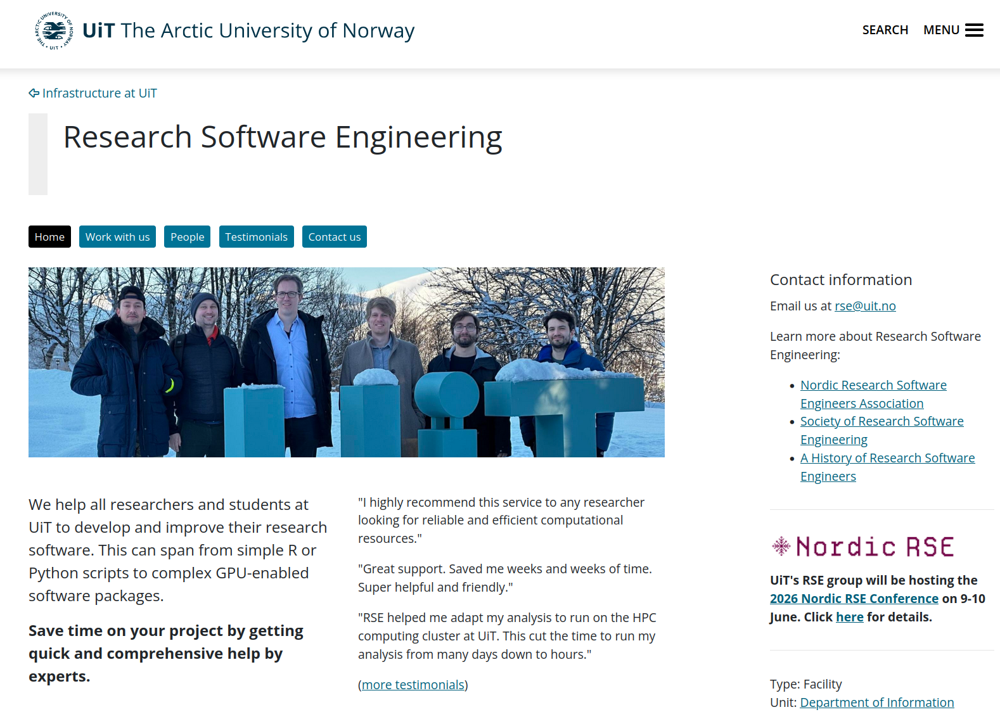

class: gray-background

# Research software engineering at UiT

# [research-software.uit.no](https://research-software.uit.no/)

---
# Software-related challenges in research

---

# Software-related challenges in research

---

# Research software engineers

.. are people who combine .emph[professional software expertise] with an .emph[understanding of research] .cite[https://researchsoftware.org/]

- Often people **who grew up in research** and liked computing and programming

- ... or people **who come from software development** drawn towards meaningful and impactful work of academia

## Resources

- [Society of Research Software Engineering](https://society-rse.org/)
- Recent conference: [RSECon 2023](https://rsecon23.society-rse.org/)
- https://nordic-rse.org/
- [Nordic-RSE unconference 2023](https://nordic-rse.org/events/2023-online-unconference/)

---

# Help with improving your scripts/code

- .emph[Code review] (we discuss code in a constructive way)
- Making code .emph[more reusable]
- Good practices for documentation

---

# Help with organising your code

.left-column50[
- Git, GitHub, and GitLab

- Moving your work/project/code/data to Git

- Modularizing your code

- Organization of reusable Python/R notebooks
]

.right-column50[

]

---

# Help with sharing your code

.left-column50[
- Help with software licenses and open sourcing

- Publishing code

- Packaging and sharing software

- Containerization (Singularity, Docker)

- PyPI and Conda
]

.right-column50[

]

---

# Getting results sooner

.left-column50[
- Improving scaling, CPU, and memory optimization

- Porting to GPU

- Moving from local computer to cloud or HPC

- Helping with running independent steps in parallel
]

.right-column50[

.cite[Midjourney, CC-BY-NC 4.0]
]

---

# Our vision

## Short term

- Provide consulting: good advice is **not** expensive
- .emph[Code review] sessions
- Work on "smaller" projects and .emph[document use cases]
- Focus on UiT
- Attract more projects 

## Longer term

- Be part of funding applications (successful applications with Hylleraas Centre and Framsenteret)
- Research groups have access to best in class RSE services
- Hire more staff who collaborate on projects
- "Proper" application procedure 
- Going beyond UiT
- .emph[Career path opportunities]

---

# RSE is an established field

.left-column50[

]

.right-column50[

]
---

---
class: center, middle, inverse

# Office hours: Wednesday 13:00 - 15:00

## https://research-software.uit.no/contact/

## Email: rse@uit.no 

