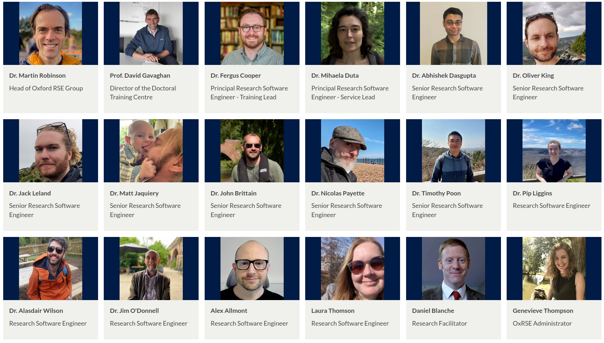
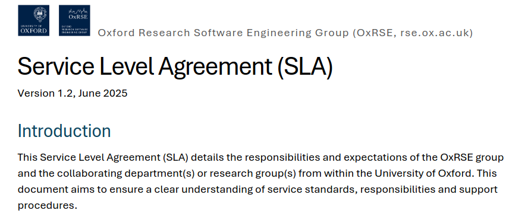
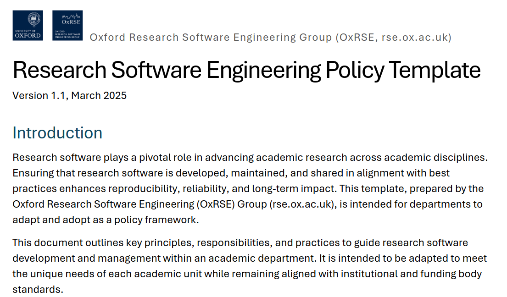
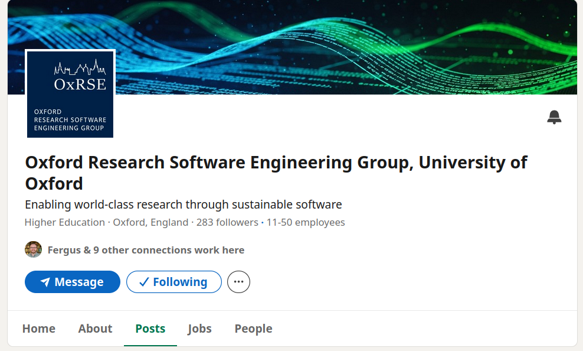

class: gray-background

# Lessons learned from OxRSE

---

# Topics

Organization of OxRSE

Website feedback

Teaching

RSE & HPC at UCL

Interesting Software Projects

Suggested next steps for RSE at UiT 

---

# Organization of OxRSE

- 16 full time RSEs + 2 admin staff + at least 3 new employees starting soon

- Part of the Doctoral Training Center (DTC) 

- Not connected to IT department or HPC services (but other Universities in the UK)

- University provided underwrite for 3 positions to get things rolling

- Underwrite was never used because enough projects came in

- Tighter connection of RSE group to research community than at UiT

---
## Internal organization

- Private Github repo for project management

- Github discussions for external research groups https://github.com/orgs/OxfordRSE/discussions/categories/help

- formalized SLA:

- If possible, at least 2 RSEs on one project (to avoid bus factor) with one "lead" RSE

---
## Internal organization (2)

- RSEs are given a lot of autonomy

- No centralized repository for projects

- Policy template

- RSEs usually have at least 2 projects at the same time, some have 3-4
---

## New projects

- New requests handled as issues on private Github repo

- OxRSE says "yes" to almost everything

- Initial 30 min meeting to discuss project

- SLA used to agree on timelines, scope etc. (no formal contract)

- small number of external projects (1-2 at the moment), charges double rate

---

## Outreach

- Relying mainly on word of mouth

- No office hours or help desk (OxRSE doesn't have time)

- OxRSE provides Code surgeries / Code reviews

- hesitating to advertise more because of load

- RSEs presented more like scientists than serfice providers (speak the language of researchers, not of the IT services)

---
## publications

- RSEs usually co-author papers

- No expectation to publish as first author but some do

---
## Financing

- Most of money comes from existing grants

- Almost as big is funding where researchers applied toghether with RSEs

- RSEs also apply for funding themselves

- **Very luctracive**: Every university has some funding for turining research into a comercial product / startups

- apply to dedicated software funding like the “Chan Zuckerberg Initiative (CZI) Open Software Funding”

---
## Projects

- Developement of web (and even mobile) apps

- Almost no green field projects

- Python and C++ by far most used languages

- Very little R, but that might change soon with new employees

- Rust is used for some projects

- Julia is "bubbling around"

--- 
## Size of organization

- UiT has roughly 16000 undergraduate students, 800 PhD studernts and 1700 academic staff

- Oxford has 12,375 undergraduate students, 13,650 graduate students and 7,220 academic staff

- However, OxRSE is far from being saturated, other UK universities (especially UCL) have much bigger RSE groups
