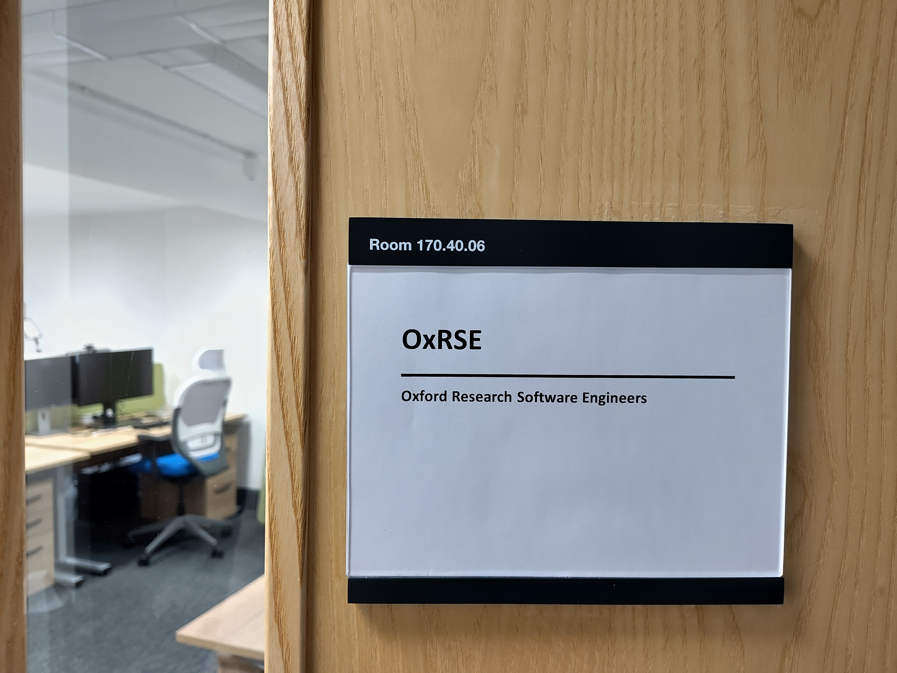
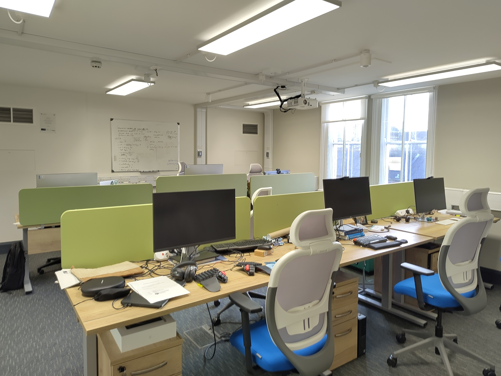
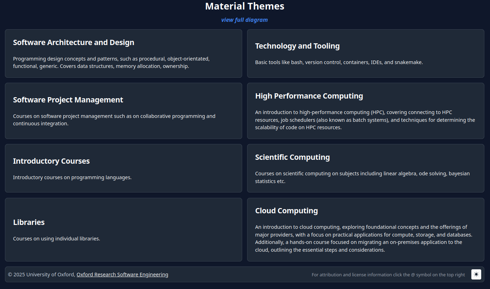
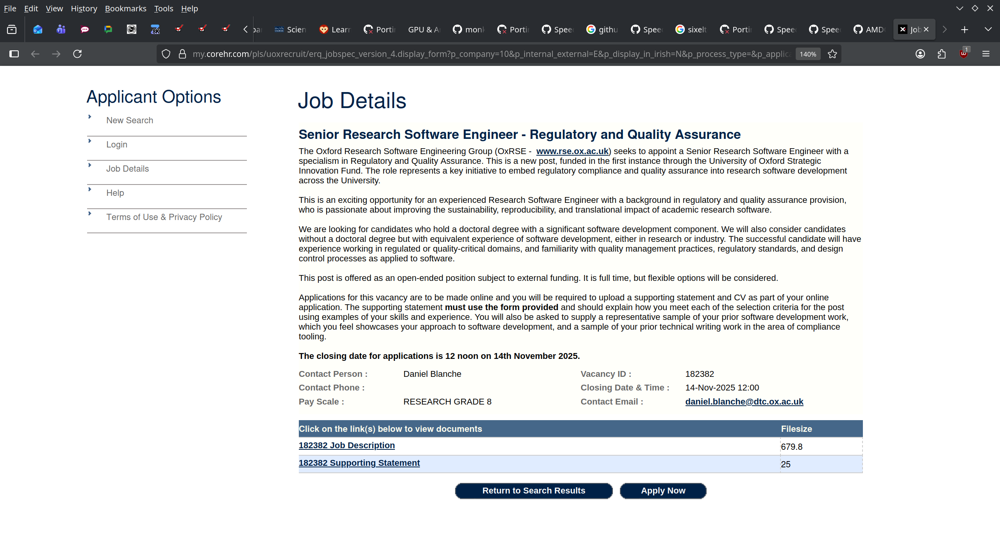
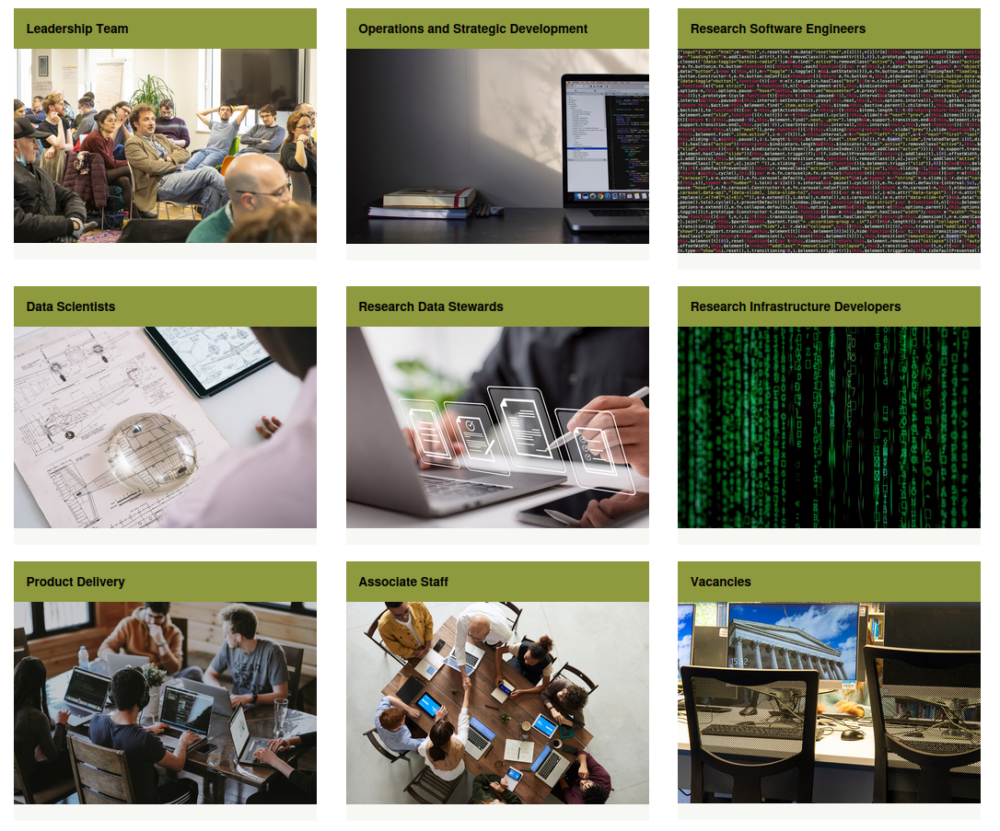
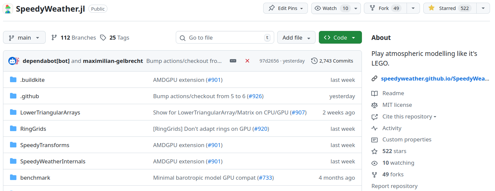
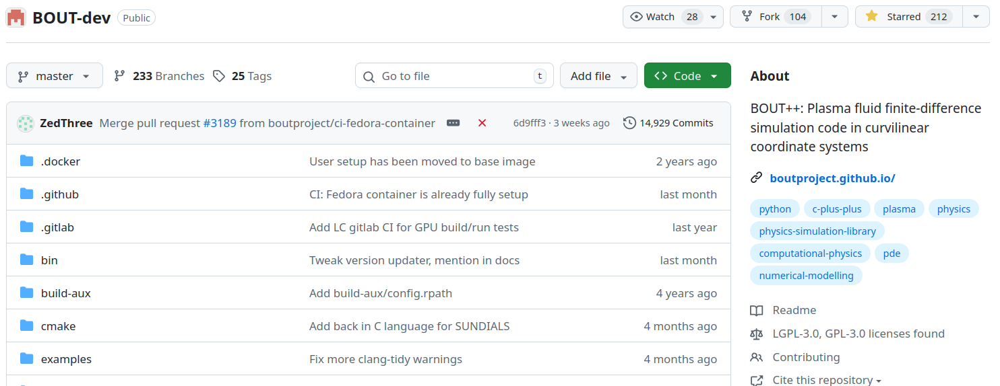
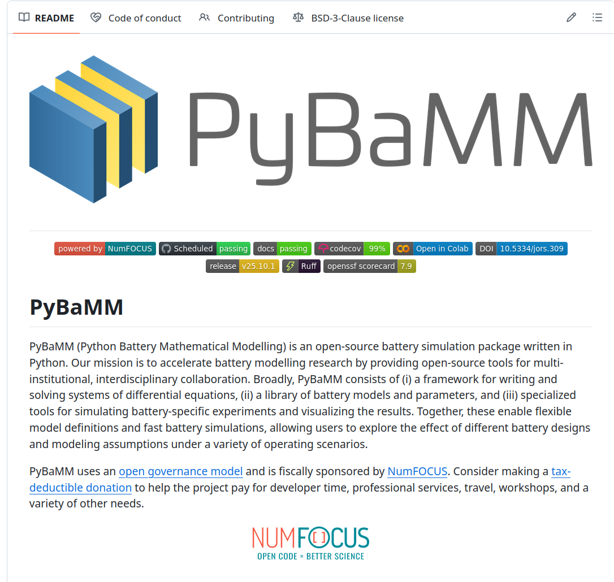
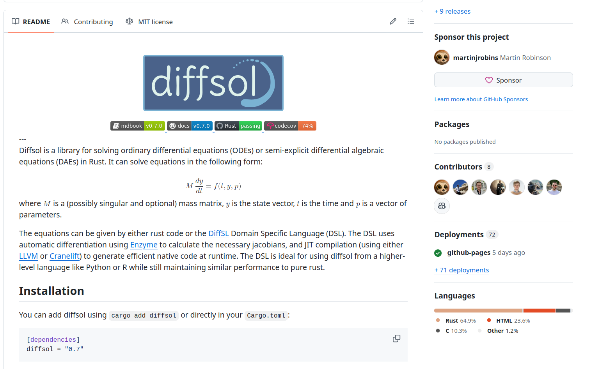

class: gray-background

# Lessons learned from OxRSE

---

# Topics

Organization of OxRSE

Website feedback

Teaching

RSE & HPC at UCL

Interesting Software Projects

Suggested next steps for RSE at UiT 

---

- located in the Doctoral Training Centre (DTC) in Keble Rd
---

---

---

# Organization of OxRSE

- 16 full time RSEs + 2 admin staff + at least 3 new employees starting soon

- Part of the Doctoral Training Center (DTC) 

- Not connected to IT department or HPC services

- University provided underwrite for 3 positions to get things rolling

- Underwrite was never used because enough projects came in

- Tighter connection of RSE group to research community than at UiT

---
## Internal organization

- Private Github repo for project management

- Github discussions for external research groups https://github.com/orgs/OxfordRSE/discussions/categories/help

- formalized SLA:

- If possible, at least 2 RSEs on one project (to avoid bus factor) with one "lead" RSE

---
## Internal organization (2)

- RSEs are given a lot of autonomy

- No centralized repository for projects

- Policy template

- RSEs usually have at least 2 projects at the same time, some have 3-4
---

## New projects

- New requests handled as issues in private Github repo

- OxRSE says "yes" to almost everything

- Initial 30 min meeting to discuss project

- SLA used to agree on timelines, scope etc. (no formal contract)

- small number of external projects (1-2 at the moment), charges double rate

---

## Outreach

- Relying mainly on word of mouth

- No office hours or help desk (OxRSE doesn't have time)

- OxRSE provides Code surgeries / Code reviews

- hesitating to advertise more because of load

- RSEs presented more like scientists than service providers (speak the language of researchers, not of the IT services)

---
## publications

- RSEs usually co-author papers

- No expectation to publish as first author but some do

---
## Financing

- Most of money comes from existing grants

- Almost as big is funding where researchers applied together with RSEs

- RSEs also apply for funding themselves

- **Very lucrative**: Every university has some funding for turning research into a commercial product / startups

- apply to dedicated software funding like the “Chan Zuckerberg Initiative (CZI) Open Software Funding”

- distinguish yourself to an external company, they are not bound by the same rules and IP (intellectual property) -> a lot of codebases are closed source that oxrse works with, IP stays with university -> no NDAs needed
---
## Projects

- Development of web (and even mobile) apps

- Almost no green field projects

- Python and C++ by far most used languages

- Very little R, but that might change soon with new employees

- Rust is used for some projects

- Julia is "bubbling around"

---
## Size of organization

- UiT has roughly 16000 undergraduate students, 800 PhD students and 1700 academic staff

- Oxford has 12,375 undergraduate students, 13,650 graduate students and 7,220 academic staff

- However, OxRSE is far from being saturated, other UK universities (especially UCL) have much bigger RSE groups

---
# Website feedback

- provide links to other rse organizations, societies, show that we are not doing RSE on our own

- avoid scrolling on website

- be proactive (don’t say we want to help, say we help…)

- put logo of university institution, don’t look like something outside of the university

- logos on top of every page

---
# Website feedback (2)

- services is not good -> work with us is better, we are not a plumber or the normal IT department, communicate that we work with people

- projects -> portfolio

- about us -> people (people like people, mention background of every single engineer on the website)

- all the successful groups have people on their website, this builds confidence

- if you don’t maintain the blog remove it, have something once a month, doesn't have to be long (LLMs help)

- don’t call something draft (we do that in the blob)

---
# Teaching

---

## Teaching activities

- Teaching mainly PhD students and postdocs

- courses have been extremely popular even though they don't give credit points

- github codespaces provides around 60h -> great environment for beginners

- run rse course three times a year, in 5 consecutive Fridays, 10 topics

- doesn't bring in much money, but great as outreach

---
# Job postings and interviews

---

## Interview questions

- Candidates get 30 min before some technical questions where they need to pick one

- One example is getting a link to GitHub repo and they should review it

- Can be also other questions, like data pipelines, etc.

- More important how candidates approach the problem than getting the solution

---

## Advertising channels

- RSE slack channel

- RSE society

- LinkedIn in order to get people outside of RSE bobble

- Advertise at University since most strong candidates come directly from academia 

---

## RSE skill set

- Advertise RSEs as people interested in research, not as service providers

- Academics value their peers

- Almost every RSE has a PhD (if not, they need at least 5 years of experience from somewhere else)

- Needed skill set much broader than SEs in industry

- Find people that are passionate about research and software

- People that care about salary won't thrive as RSEs, better suited for industry (employ "Dreamers")

- future funding depends on the people you send to researchers

---

# RSE & HPC at UCL

---
## RSE & HPC at UCL

- started with three positions, now more than 60 people

- most positions are funded via grants

- Started in the IT department

- RSEs also PIs in research projects

- most projects in python, some Fortran, C++, sometimes Matlab, Julia, rust, go

- recommend Julia but often it comes down to what is used in the research field

---
## RSE & HPC at UCL (2)

- online office hours

- provide some master students modules, some of them are led by RSEs

- UCL would be happy to host people for weeks/a month

- Web apps is where the money is

---
# Interesting Software Projects

- Ported to ADMGPU during my stay at OxRSE

- Performance on AMD GPUs still worse than on NVIDIA GPUs

- Low hanging fruit for Advanced User Support!

---

## BOUT++

- framework for writing fluid and plasma simulations in curvilinear geometry

- Fusion group at UiT uses it

- Another AUS opportunity

---

---

---

# Suggested next steps for RSE at UiT

- finish rse-policies-and-procedures repository 

- finish new website

- continue advertising RSE at UiT

- Set up repo to track RSE projects

- Set up Service Level Agreements (SLA)

- Apply for AUS for multiple projects

- Lobby for Norway to join Epicure (https://epicure-hpc.eu/) - huge amount of funding for EuroHPC projects similar to AUS

---
# Suggested next steps for RSE at UiT (2)

- Write blog posts about work at OxRSE 

- Get into web and mobile app development

- Set up RSE course at UiT 

- Convince department to open RSE job posting(s)

- Give good impression to RSE community at Nordic RSE conference at UiT in June 

- Apply for Erasmus+ or other funding to fund research stays at other RSE groups in Europe (OxRSE, UCL, York, Newcastle, Aalto, etc.) 
