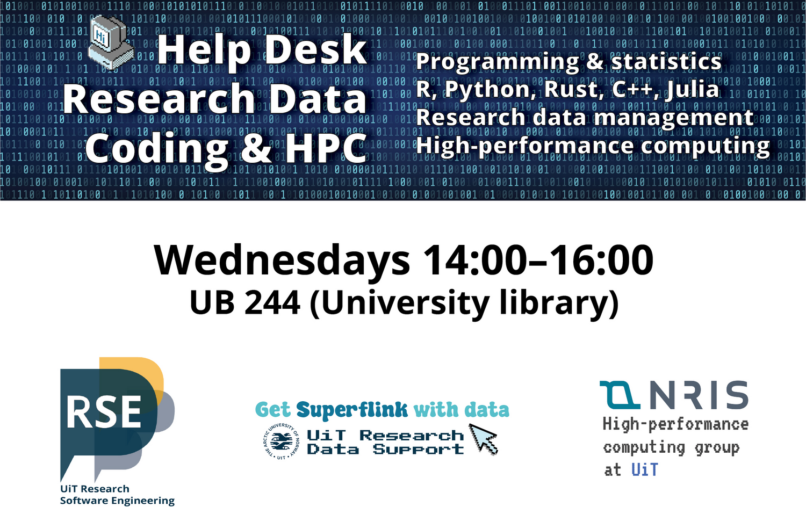

class: gray-background, middle, center

# RSE at UiT The Arctic University of Norway

Gregor Decristoforo

OxRSE group meeting 5.11.2025

---

# Who we are: [research-software.uit.no](https://research-software.uit.no/)

.left-column50[
- Northern-most RSE group in the world

- We have grown to 6 part time RSEs 

- We started 2.5 years ago

- Grown out of HPC group 

- (Still) part of IT department
]

.right-column50[

]

---

---

---

<!-- ## What we do -->
<!---->
<!-- - Weekly office hours in UiT's library (2 hours/week) -->
<!---->
<!-- - Attract projects ranging from 1 hour to days -->
<!---->
<!-- - Satellite office hours at different research groups -->
<!---->
<!-- - In close contact with the library's data team -->
<!---->
<!-- - Support researchers via email -->
<!---->
<!-- - **Support long term projects with dedicated RSE funding** -->
<!---->
<!-- --- -->
<!---->
<!-- --- -->

# RSE service levels

- **Help Desk:**   2 hours on (almost) every Wednesday at the UiT Library (UB 244)    .emph[FREE] (first come/first serve)

- **Individual Consultations:**   One-on-one with an RSE engineer   Initial consultation free, afterwards 600 kr/hr (5-hour minimum)

- **Extended Collaborations:**    Part-time or full-time contracts with the RSE group   Include us in your grant applications! - 600kr/hr 

---

---

# Example 1

Speed-up of grid mesh generation for oceanography code from days to seconds by a code
rewrite from Matlab to Python+Rust using a more optimal algorithm

---

# Example 2

.left-column50[
- Bioaccumulation model for organic contaminants developed for arctic ecosystems

- Translated 10k lines of 20+ year old Visual Basic code to Python 
]

.right-column50[

]

---

# Our challenges

- Visibility to researchers

- Convincing higher-ups RSE is important

- Prioritize RSE work over other duties

- Dedicated statistics support

- **Dedicated funding for RSE work**

---

<!-- ## Survey results -->
<!---->
<!-- How likely is it that you would recommend our support to a friend of colleague? -->
<!---->
<!-- 
<!--      alt="Plot estimating time saving" -->
<!--      style="width: 300px;"/> -->
<!---->
<!-- In your estimate, how much time have you saved as a result of working with us? -->
<!---->
<!-- 
<!--      alt="How likely are you to recommend?" -->
<!--      STYLE="WIDTH: 300PX;"/> -->
<!---->
<!-- --- -->

# Future plans

- Get involved in grant applications 

- Standardize application for RSE services at UiT

- Exchange with other European RSE groups

- Employ people as dedicated RSEs (not HPC engineers)

- **Organize Nordic RSE conference 2026**

---

source: www.fjellheisen.no

Welcome to Nordic-RSE Tromsø | June 9-10, 2026
