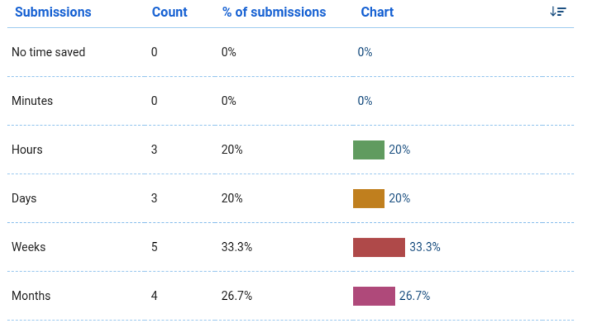

class: gray-background, middle, center

# An update to RSE at UiT

**Jørn Dietze**, **Gregor Decristoforo**, UiT The Arctic University of Norway

Nordic RSE conference 2024

---

## Who we are: [research-software.uit.no](https://research-software.uit.no/)

.left-column50[
- Northern-most RSE group in the world

- We have grown to 6 part time RSEs 

- We started 2.5 years ago

- Grown out of HPC group 

- (Still) part of IT department
]

.right-column50[

]

---

## What we do

- Weekly office hours in UiT's library (2 hours/week)

- Attract projects ranging from 1 hour to days

- Satellite office hours at different research groups

- In close contact with the library's data team

- Support researchers via email

- **Support long term projects with dedicated RSE funding**

---

## Our challenges

- Visibility to researchers

- Convincing higher-ups RSE is important

- Prioritize RSE work over other duties

- Dedicated statistics support

- **Dedicated funding for RSE work**

---

## Survey results

How likely is it that you would recommend our support to a friend of colleague?

In your estimate, how much time have you saved as a result of working with us?

---

## Future plans

- Get involved in grant applications 

- Standardize application for RSE services at UiT

- Exchange with other European RSE groups

- Employ people as dedicated RSEs (not HPC engineers)

- **Organize Nordic RSE conference 2026**
