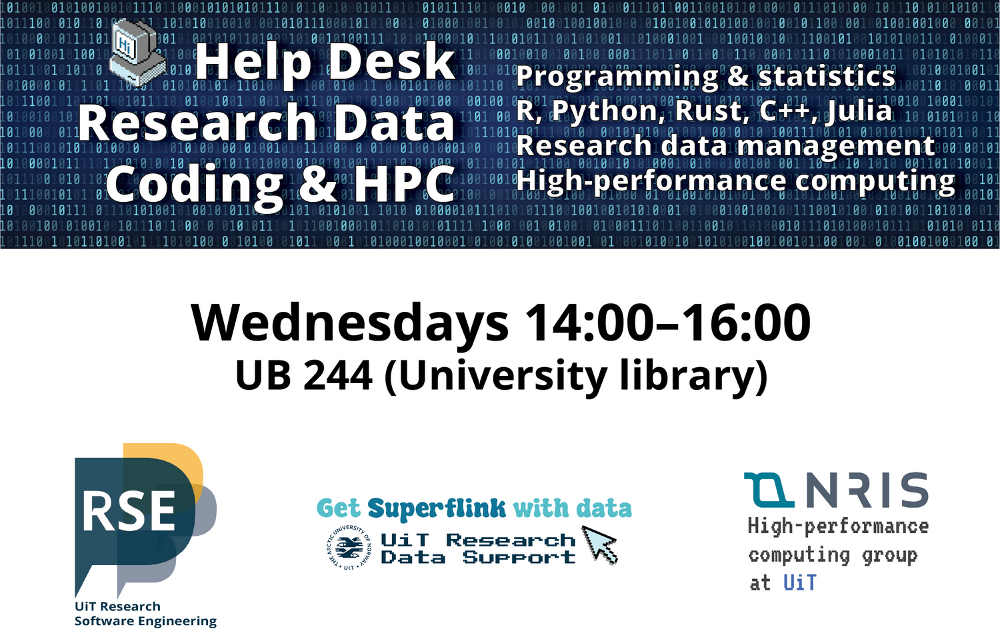
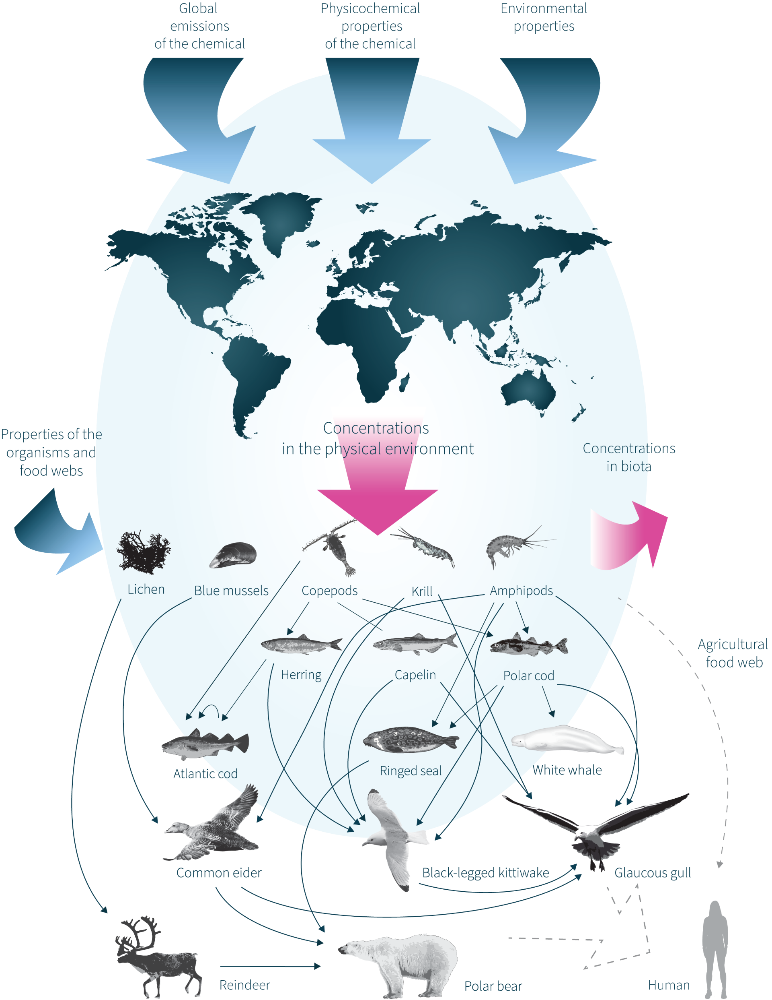
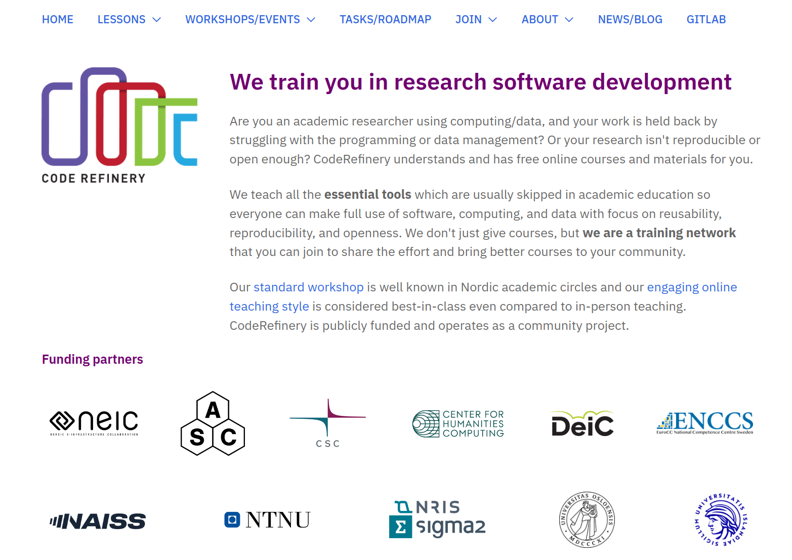
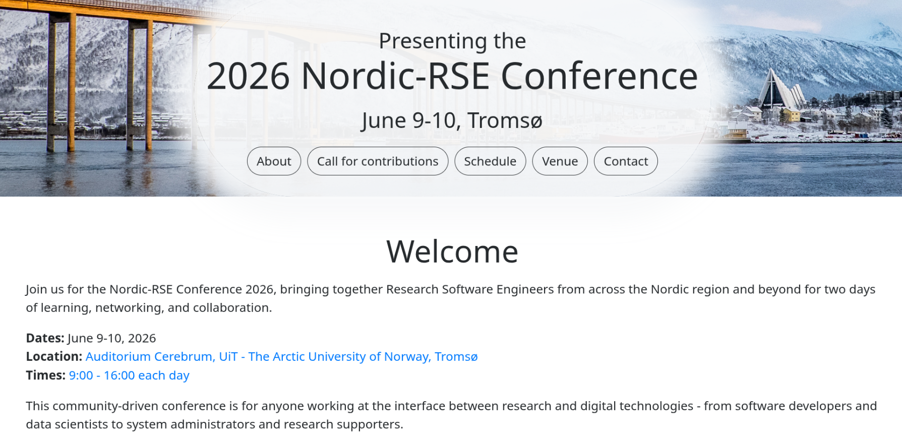

class: gray-background

# Research software engineering at UiT

# [research-software.uit.no](https://research-software.uit.no/)

---
# Software development is part of research

- Scientists typically spend **30%** of their time developing software

- 90% or more are primarily self-taught

- Many are unaware of tools and practices that would allow them to write **more reliable and maintainable code** with less effort

.cite[Wilson, Greg, et al. "Best practices for scientific computing." PLoS biology 12.1 (2014): e1001745.]

---

# Research software engineers

- ... are people who combine .emph[professional software expertise] with an .emph[understanding of research] .cite[https://researchsoftware.org/]

- Often people **who grew up in research** and liked computing and programming

- ... or people **who come from software development** drawn towards meaningful and impactful work of academia

## Resources

- [Society of Research Software Engineering](https://society-rse.org/)
- Recent conference: [RSECon 2025](https://rsecon25.society-rse.org/)
- https://nordic-rse.org/
- [Nordic-RSE conference 2025](https://nordic-rse.org/blog/nrse-conference-report/)

---

---

# Help with improving your scripts/code

- .emph[Collaborative code review] (we discuss code in a constructive way)
- Making code .emph[cleaner, faster, and more reusable]
- Best practices for documentation

---

# Help with organising your code

.left-column50[
- Git, GitHub, and GitLab

- Moving your work/project/code/data to Git

- Modularizing your code

- Organization of reusable Python/R notebooks
]

.right-column50[

]

---

# Help with sharing your code

.left-column50[
- Help with software licenses and open sourcing

- Publishing code

- Packaging and sharing software

- Containerization (Singularity, Docker)

- PyPI and Conda

- Journal of Open Source Software (JOSS)

]

.right-column50[

]

---

# Getting results sooner

.left-column50[
- Improving scaling, CPU, and memory optimization

- Porting to GPU

- Moving from local computer to cloud or high-performance computing clusters

- Helping with running independent steps in parallel
]

.right-column50[

.cite[Midjourney, CC-BY-NC 4.0]
]

---

# Work with us

- **RSE Help Desk:**   2 hours on (almost) every Wednesday at the UiT Library (UB 338)    .emph[FREE] (first come/first serve)

- **Individual Consultations:**   One-on-one with an RSE engineer   Initial consultation free, afterwards 600 kr/hr (5-hour minimum)

- **Extended Collaborations:**    Part-time or full-time contracts with the RSE group   Include us in your grant applications! - 600kr/hr 

---

---

# Example 1

Speed-up of grid mesh generation for oceanography code from days to seconds by a code
rewrite from Matlab to Python+Rust using a more optimal algorithm

---

# Example 2

.left-column50[
- Bioaccumulation model for organic contaminants developed for arctic ecosystems

- Translated 10k lines of 20+ year old Visual Basic code to Python 
]

.right-column50[

]

---

---

## PhD course at UiT: FYS-8805 Collaborative Coding

- One week of lectures + home exam

- 5 credit points 

- Lecture material is public: [fys-8805-collaborative-coding.github.io/lecture-material](fys-8805-collaborative-coding.github.io/lecture-material)

- Next course: probably later this semester

- **Let us know if you are interested!**

---
## UiT organizes the next Nordic RSE conference

more info at [nordic-rse.org/nrse2026](https://nordic-rse.org/nrse2026/)
---
class: center, middle, inverse

# RSE Help Desk: Wednesday 14:00 - 16:00

## https://research-software.uit.no/contact/

## Email: rse@uit.no 

