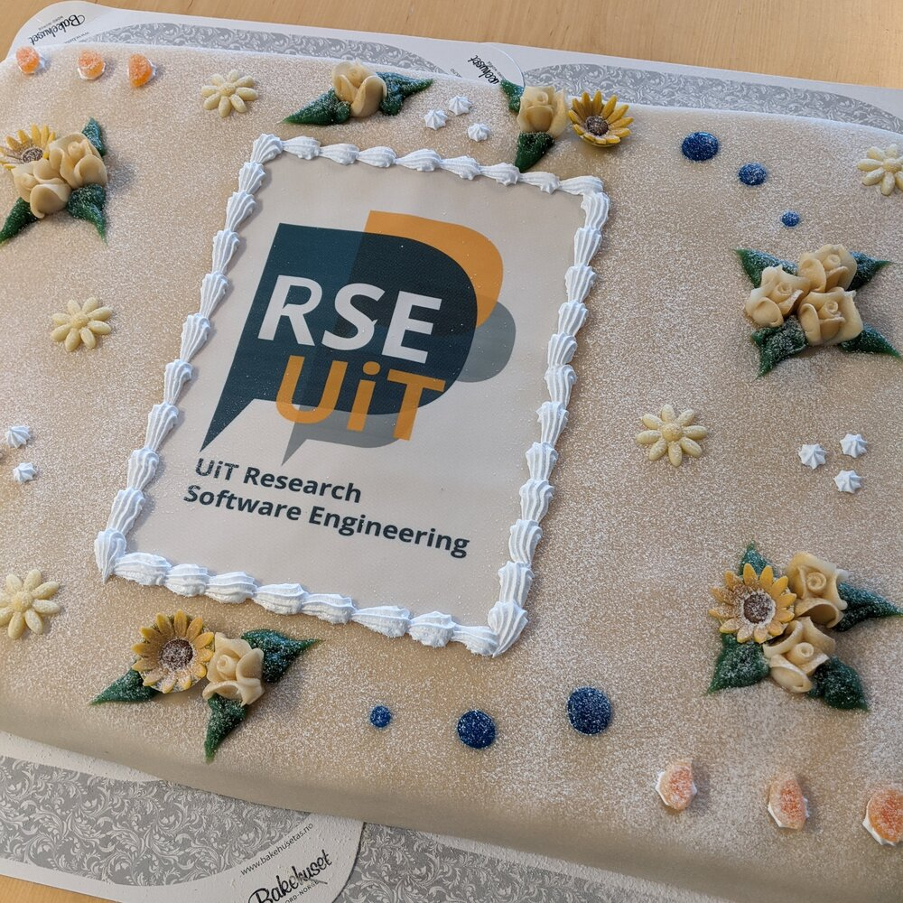

class: gray-background, middle, center

# Lessons learned from running a local RSE group: [research-software.uit.no](https://research-software.uit.no/)

**Radovan Bast**, UiT The Arctic University of Norway

Nordic RSE conference 2024


---

# Lessons learned ...

- Why research software engineering is important

- Why we thought that our university should have an RSE group

- Why every university should have an RSE group

---

# This talk is not about

- Why research software engineering is important

- Why we thought that our university should have an RSE group

- Why every university should have an RSE group

--

# This talk is about

- How we started

- Growing pains

- What we know now that we wish we knew earlier

- Most common problems we see

---

## How we started: [research-software.uit.no](https://research-software.uit.no/)

.left-column50[
1. Create a website

1. Get a nice subdomain

1. Talk about it and repeat yourself

1. Send an email to all department with "cake" in the subject

1. Invite yourself to other department seminars
]

.right-column50[

]

---

# Help with improving your scripts/code

- .emph[Code review] (we discuss code in a constructive way)
- Making code .emph[more reusable]
- Good practices for documentation


---

## Our workflow

- Weekly office hours (afternoon).

- Attract projects ranging from 1 hour to days.

- Track projects:
```yml
    name: Mathematica on Fram
    contact: Jane Doe <jane.doe@example.org>
    department: Department of Mathematics and Statistics
    staff: Staff who worked on it
    summary: |
      A sentence/paragraph summarizing what this is/was about.
    status: finished
```
  - For each project write at least a sentence on the website.
  - For larger projects write a blog post.
  - "If it isn't documented, it didn't happen".

---

## Our workflow

- Selecting projects: Currently we say "yes" to everything that we know we can solve.

- Status: 40 projects. Roughly 1 new project per office hour.

---

## Growing pains

- Started with only a personal email and then lost overview ->
  Create a group email address and connect it to an issue tracker.

- Too many cooks: Student asking and 3 staff answering ->
  Let one staff lead the discussion and help even when you feel like you
  know a "better" answer.

- Where do we track projects that take longer than an afternoon?

- Office hours work well. But should we do office hours in-person or online?

---
class: inverse, middle, center

# What we know now that we wish we knew earlier

---

## What we know now that we wish we knew earlier

- Students and researchers love it but university "has no budget for it"

- We expected more questions about code review and code structure

- Surprisingly many questions about statistics and AI model choices

- You can see that people are happy but you need to measure it

- Document as you go (like when you visit your general practitioner)

---

## Most common problems we see

- Code is a 7k lines long notebook (Jupyter or Rmarkdown)

- Not reusable: Dependencies not documented. No functions. Example only runs
  by running code sections in a specific order.

- Hard-coded paths. No command-line interface.

- Execution takes a long time and or lots of memory.

- Lengthy independent work chunks are computed in a loop.

- Code repetition.

- It takes us a lot of effort to create a minimal working example.

---

## Survey results

[work in progress]
