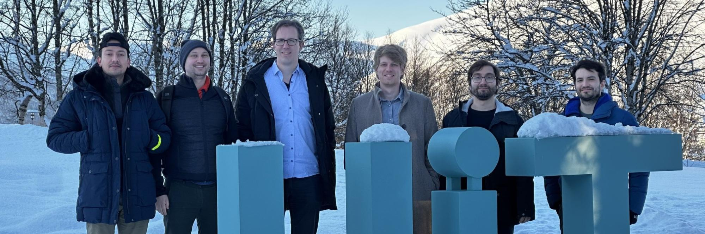

class: gray-background

<!-- &nbsp;   -->
&nbsp;  
&nbsp;  
.right-column50[

]

.left-column50[
# Research Software Engineering at UiT

]
<!-- &nbsp;   -->
<!-- &nbsp;   -->
<!-- &nbsp;   -->
<!-- &nbsp;   -->
<!-- &nbsp;   -->
<!-- # [research&#8209;software.uit.no](https://research-software.uit.no/) -->

---
# Research Software Engineers

- ... are people who combine .emph[professional software expertise] with an .emph[understanding of research] .cite[https://researchsoftware.org/]

- Often people **who grew up in research** and liked computing and programming

- ... or people **who come from software development** drawn towards meaningful and impactful work of academia

## Resources

- [Society of Research Software Engineering](https://society-rse.org/)
- [Nordic-RSE Association](https://nordic-rse.org/)
- [Nordic-RSE Conference 2026](https://nordic-rse.org/nrse2026/)
---
# What we can help you with

.left-column50[
### Improving your scripts/code
- Code review
- More reproducible and reusable code
- Improve code documentation

### Organising your code
- Modularizing and streamlining your code
- Moving your work/project/code/data to Git
- Git, GitHub, and GitLab
]
.right-column50[
### Sharing your code
- Publishing your code
- Software licenses and open-sourcing
- Packaging and sharing software
- Using/creating containers (Singularity, Docker)

### Running your code faster
- Improving performance and scaling
- Accelerating your code with GPUs
- Moving from local computer to cloud or high-performance computing 
]

---
# Work with us

- **RSE Help Desk:**   2 hours on (almost) every Wednesday at the UiT Library (UB 338)    .emph[FREE] (first come/first serve)

- **Individual Consultations:**   One-on-one with an RSE engineer   Initial consultation free, afterwards 600 kr/hr (5-hour minimum)

- **Extended Collaborations:**    Part-time or full-time contracts with the RSE group   Include us in your grant applications! - 600kr/hr 

- **Not affiliated to UiT:**   We can still help!   Contact us to discuss options and pricing

---

---
class: center, middle, inverse

# RSE Help Desk: 
## [Wednesday 14:00&#8209;16:00](https://uit.no/tavla/artikkel/879633/_help_desk_for_coding_support_research_data_man)

&nbsp;  
&nbsp;  
# [research-software.uit.no](https://research-software.uit.no/)

## Email: rse@uit.no 
